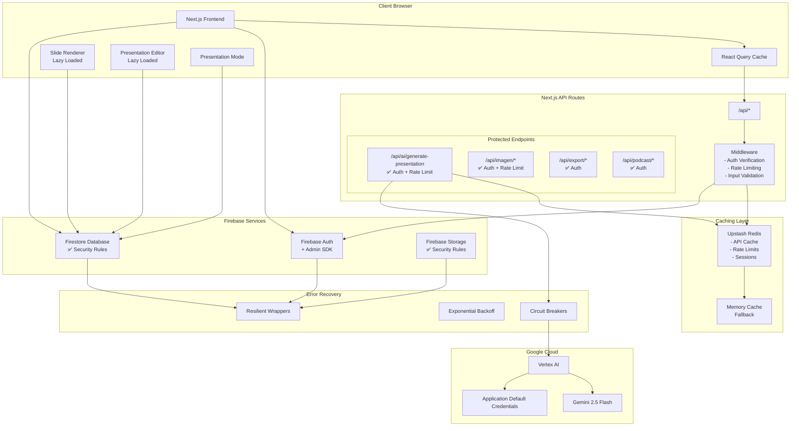
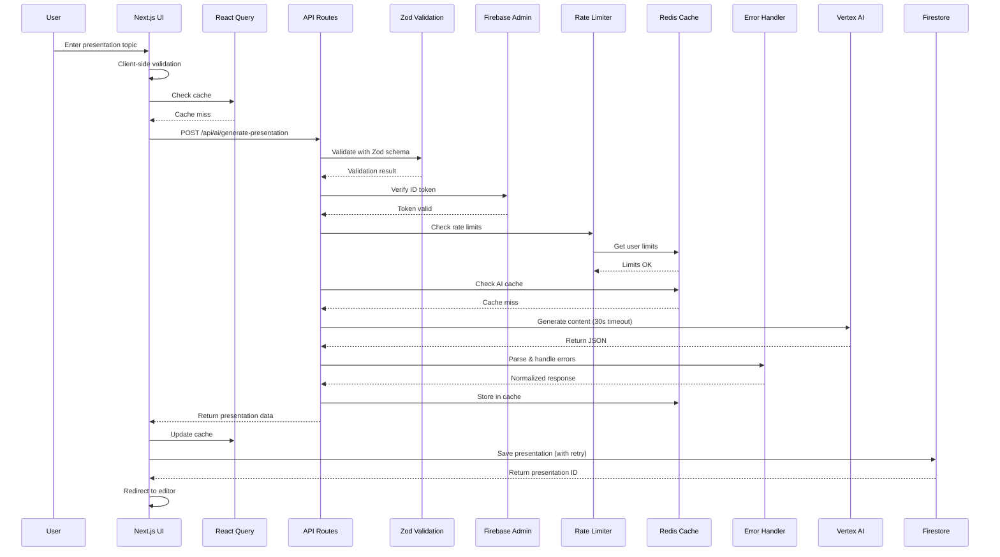
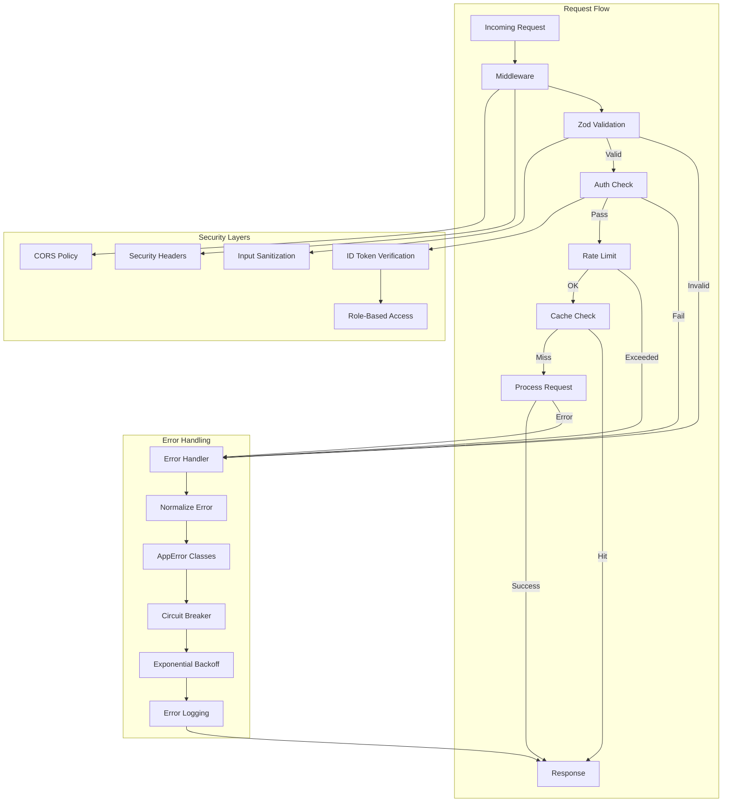
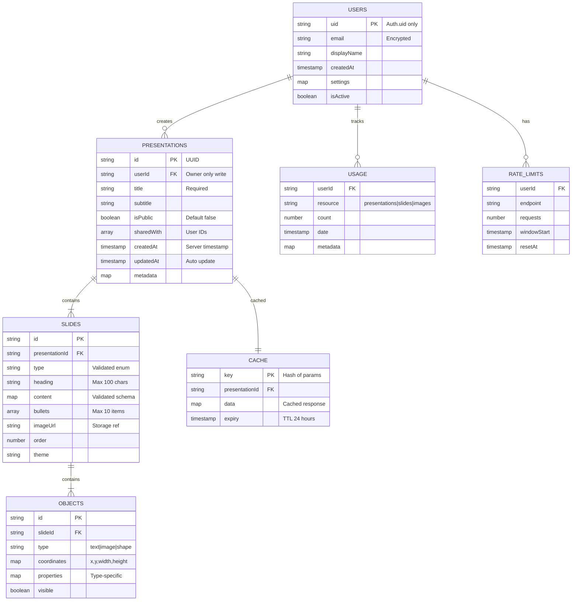
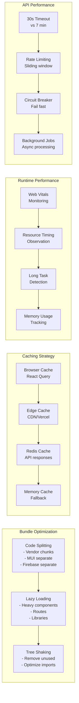
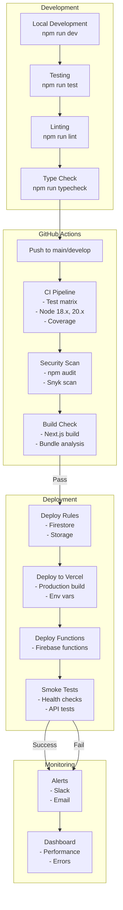
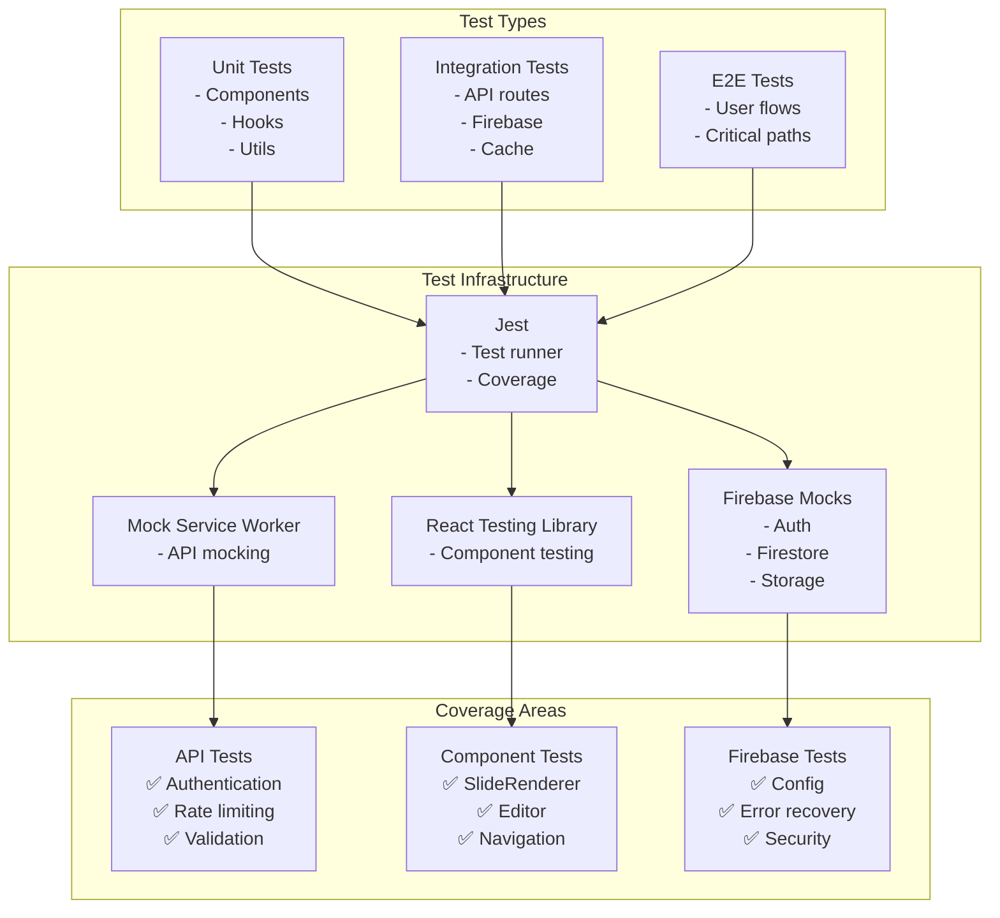
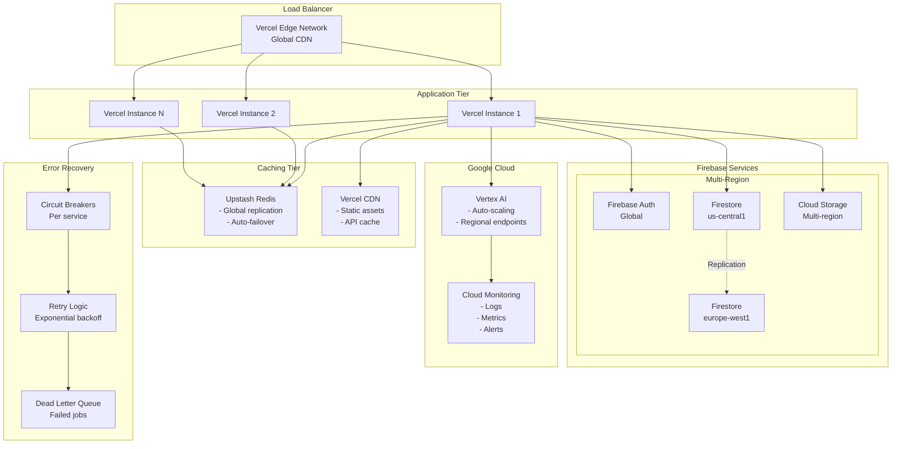
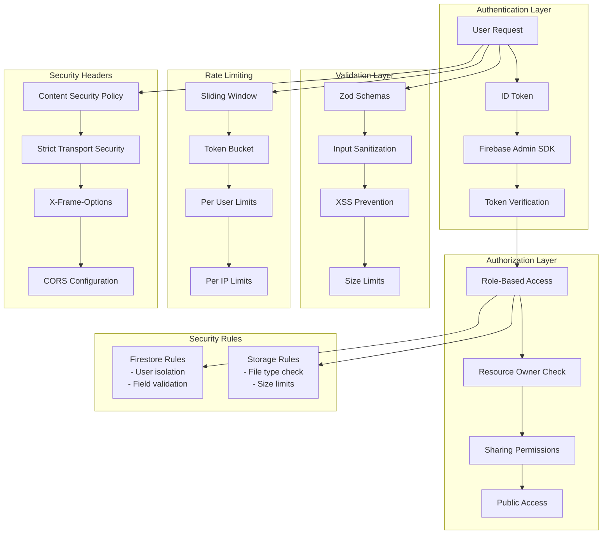

# Phoenix Web Architecture Diagrams (Updated)

## System Architecture Overview (Production-Ready)



## Enhanced Data Flow with Security & Caching



## Component Architecture with New Features

```mermaid
graph TD
    subgraph "Pages"
        Home[index.tsx]
        Gen[generate.tsx]
        List[presentations/index.tsx]
        Edit[presentations/[id]/edit.tsx]
        Present[presentations/[id]/present.tsx]
        View[presentations/view.tsx]
    end
    
    subgraph "Lazy Components"
        LC[LazyComponents.tsx]
        LSR[LazySlideRenderer]
        LED[LazyPresentationEditor]
        LIG[LazyImageGenerationPanel]
        LDG[LazyDataGrid]
        LPE[LazyPowerPointExporter]
    end
    
    subgraph "Providers"
        QP[QueryProvider<br/>React Query]
        AP[AuthProvider]
        TP[ThemeProvider]
    end
    
    subgraph "Hooks"
        UA[useAuth]
        UP[usePresentation<br/>+ Caching]
        UAI[useAI]
        UIG[useImageGeneration]
    end
    
    subgraph "Core Libraries"
        FBC[firebase/config]
        FBA[firebase/admin]
        FBP[firebase/presentations]
        FER[firebase/error-recovery]
    end
    
    subgraph "Server Libraries"
        VAL[server/vertex-ai]
        SC[server/slide-converter]
        RL[server/rate-limiter]
        VS[validation/schemas]
        EH[errors/handler]
    end
    
    subgraph "Cache & Queue"
        RC[cache/redis]
        AQ[utils/async-queue]
        PM[monitoring/performance]
    end
    
    Home --> QP
    Home --> UA
    Gen --> UP
    Gen --> VS
    
    Edit --> LC
    LC --> LSR
    LC --> LED
    
    Edit --> FER
    Present --> LSR
    Present --> UP
    
    UP --> RC
    UP --> FER
    
    API --> FBA
    API --> EH
    API --> VS
    
    List --> LDG
    View --> LSR
```

## Security & Error Handling Architecture



## Database Schema with Security Rules



## API Architecture with Improvements

```mermaid
graph LR
    subgraph "API Gateway"
        GATE[API Gateway<br/>- Authentication<br/>- Rate Limiting<br/>- Caching]
    end
    
    subgraph "Main API (Consolidated)"
        AGP[POST /api/ai/generate-presentation<br/>✅ Protected<br/>✅ Validated<br/>✅ Cached<br/>30s timeout]
    end
    
    subgraph "Deprecated (Redirected)"
        SP[/api/simple-presentation<br/>→ 301 Redirect]
        FP[/api/full-presentation<br/>→ 301 Redirect]
        FSP[/api/fast-presentation<br/>→ 301 Redirect]
    end
    
    subgraph "Image APIs"
        IG[/api/imagen/generate<br/>Queue-based]
        IP[/api/imagen/process-queue<br/>Background job]
        IR[/api/imagen/retry<br/>Error recovery]
    end
    
    subgraph "Export APIs"
        PPT[/api/export/powerpoint<br/>Lazy loaded]
        PDF[/api/export/pdf<br/>Lazy loaded]
    end
    
    subgraph "Validation"
        ZOD[Zod Schemas<br/>- Input validation<br/>- Type safety<br/>- Error messages]
    end
    
    subgraph "Processing"
        QUEUE[Job Queues<br/>- Image generation<br/>- Exports<br/>- Podcasts]
        CACHE[Cache Layer<br/>- Redis/Upstash<br/>- Memory fallback]
    end
    
    GATE --> AGP
    GATE --> IG
    GATE --> PPT
    
    SP --> AGP
    FP --> AGP
    FSP --> AGP
    
    AGP --> ZOD
    IG --> ZOD
    PPT --> ZOD
    
    ZOD --> QUEUE
    ZOD --> CACHE
    
    IG --> QUEUE
    IP --> QUEUE
```

## Performance Optimization Strategy



## CI/CD Pipeline



## Testing Architecture



## Production Deployment Architecture



## Security Model



---

*Architecture diagrams updated: August 25, 2025*  
*Reflects all implemented improvements including security, caching, error recovery, and performance optimizations*