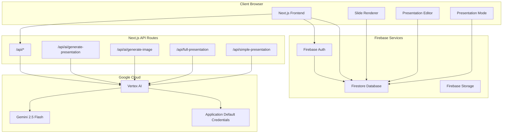
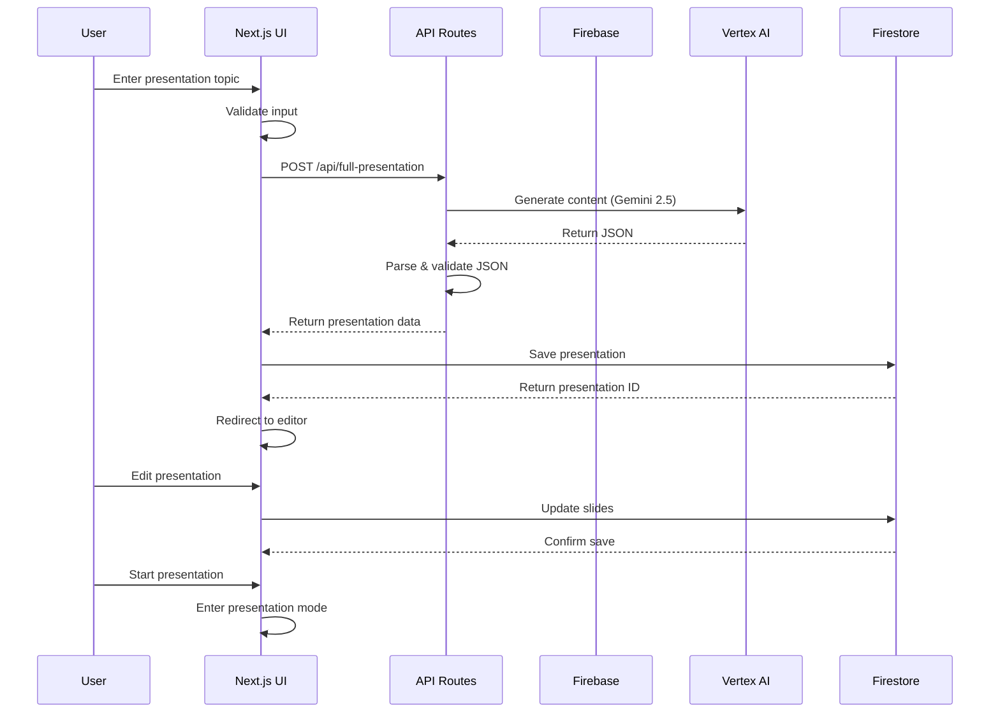
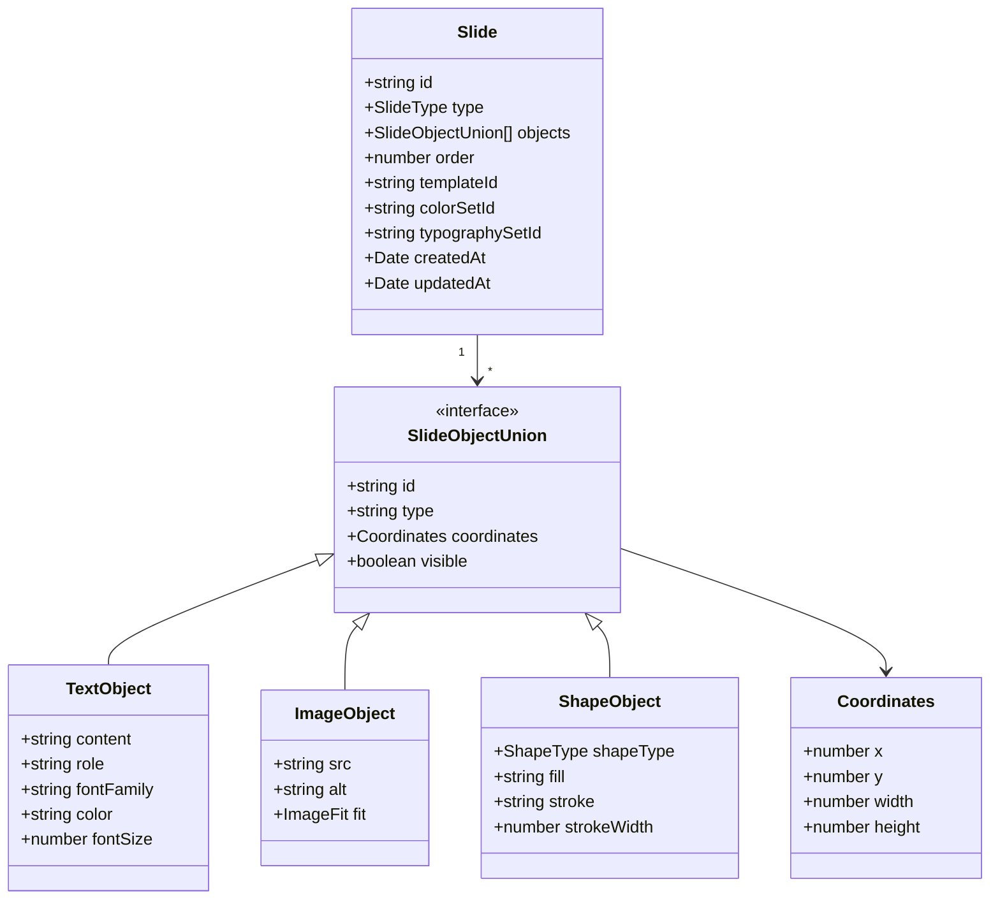
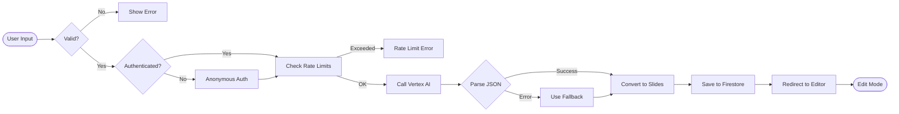
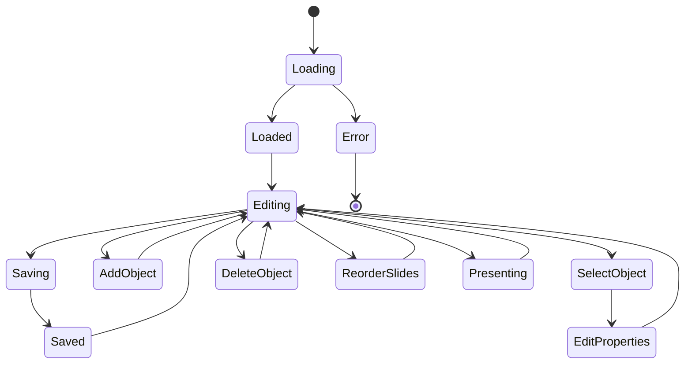
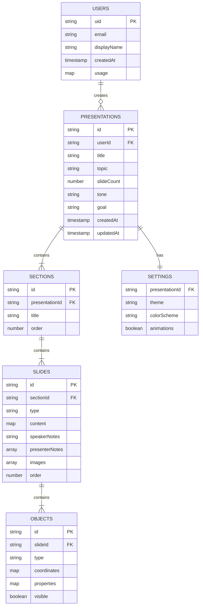
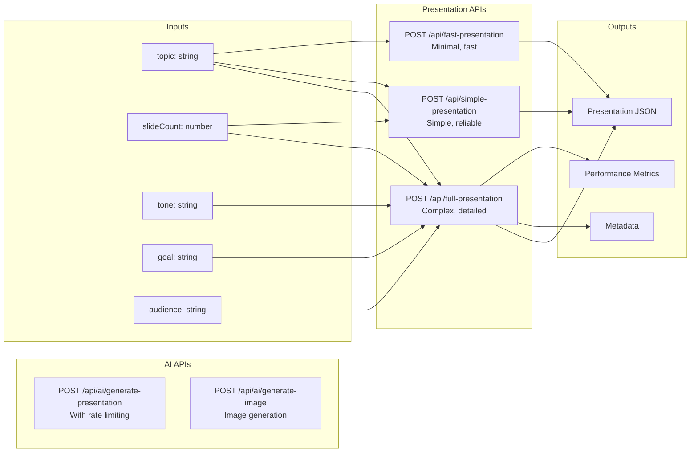
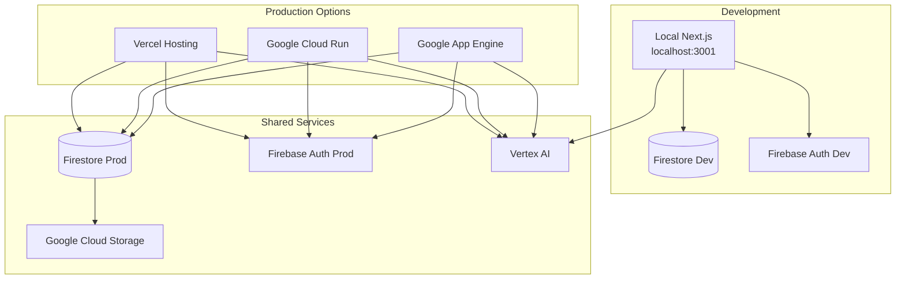
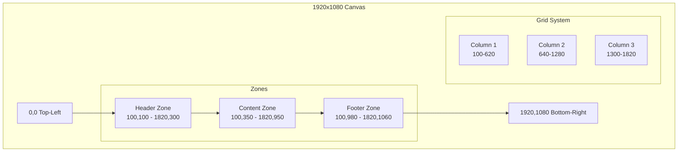

# Phoenix Web Architecture Diagrams

## System Architecture Overview



## Data Flow Diagram



## Component Architecture

```mermaid
graph TD
    subgraph "Pages"
        Home[index.tsx]
        Gen[generate.tsx]
        List[presentations/index.tsx]
        Edit[presentations/[id]/edit.tsx]
        Present[presentations/[id]/present.tsx]
        View[presentations/view.tsx]
    end
    
    subgraph "Components"
        SR[SlideRenderer]
        SO[Slide Objects]
        TO[TextObject]
        IO[ImageObject]
        SHO[ShapeObject]
    end
    
    subgraph "Hooks"
        UA[useAuth]
        UAI[useAI]
    end
    
    subgraph "Libraries"
        FBC[firebase/config]
        FBP[firebase/presentations]
        VAL[server/vertex-ai]
        SC[server/slide-converter]
        RL[server/rate-limiter]
    end
    
    Home --> UA
    Gen --> UA
    Gen --> FBP
    Gen --> VAL
    
    Edit --> SR
    Edit --> FBP
    Edit --> SO
    
    Present --> SR
    Present --> FBP
    
    SR --> TO
    SR --> IO
    SR --> SHO
    
    List --> FBP
    View --> SR
```

## Slide Object Model



## Presentation Generation Flow



## Editor State Management



## Database Schema



## API Endpoints



## Deployment Architecture



## Coordinate System

